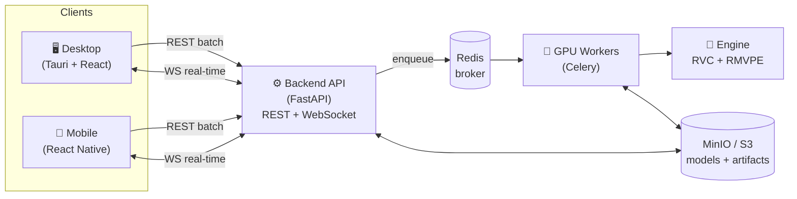

<div align="center">

# 🎙️ VoiceMorph

**Enterprise-grade, cross-platform voice conversion — speech-to-speech, not text-to-speech.**

Convert *whose* voice a recording sounds like, while preserving *what* was said, the timing, and the emotional delivery of the original speaker.

[](https://github.com/SonuSV7719/voicemorph/actions/workflows/ci.yml)
[](./LICENSE)
[](./engine/pyproject.toml)
[](./apps/desktop/package.json)
[](./backend)
[](./apps)
[](./docs/ETHICS.md)

[Quick start](#-quick-start) · [Architecture](#-architecture) · [Docs](#-documentation) · [Roadmap](./docs/ROADMAP.md) · [Ethics](#️-ethical-use)

</div>

---

## What it does

Given **(a)** a short target-voice sample and **(b)** any source audio or video, VoiceMorph produces output where the **speech content, timing, pacing, and emotion are exactly as originally spoken** — only the vocal **timbre/identity** is converted.

This is **voice conversion (VC)**, not TTS. No script is typed; nothing is transcribed and re-synthesized. VC keeps the source's F0 (pitch) contour and timing and swaps only the vocal-tract/timbre characteristics — which is what preserves the original delivery.

| Input | Output |
|---|---|
| 🎬 Video | Same video — visuals & timing untouched, **video stream bit-identical**; only the audio track's voice is converted (subtitles/metadata preserved). |
| 🔊 Audio | Converted audio, same container & duration. |

Two operating modes: **batch** (upload → job → download) and **real-time streaming** (live mic, ≤ ~300 ms on a consumer GPU).
Two native clients: a **Windows `.exe`** desktop app (Tauri, cross-buildable to macOS/Linux) and an **Android `.apk`** (React Native).

---

## ✨ Features

- **Content & emotion preserving** — F0 contour, rhythm, pauses, and stress of the original speaker are kept; duration preservation is a *checked invariant* (conversion fails loudly if timing drifts).
- **Per-voice trained models** — each target voice gets its own RVC model (`.pth` + `.index`) for maximum fidelity from as little as 10–30 min of clean audio.
- **Video-safe** — ffmpeg extract → convert → remux; the video stream is copied, never re-encoded.
- **Batch + real-time** — REST for jobs, WebSocket for low-latency streaming.
- **Scales out** — stateless API + horizontally scalable GPU workers behind a Celery/Redis queue, S3/MinIO artifact storage.
- **Runs on CPU for development** — a `passthrough` backend exercises the entire pipeline without a GPU; flip one env var to `rvc` for real conversion on GPU hardware.
- **Consent-first by design** — profiles refuse to train without an explicit, confirmed consent record.

---

## 🏗 Architecture

Voice conversion is GPU-bound, so the heavy work lives in a **backend inference server**; the native apps are **clients**. The desktop app may optionally bundle a local server when a GPU is present.



**Monorepo layout**

```
voicemorph/
├── engine/     Python — RVC training + batch/streaming inference (RMVPE pitch)
├── media/      ffmpeg extract/remux — video untouched, audio swapped, sync-safe
├── backend/    FastAPI + Celery/Redis + MinIO(S3) — REST + WebSocket, API-key auth
├── apps/
│   ├── desktop/   Tauri + React/TS  → .exe / .dmg / .AppImage
│   └── mobile/    React Native      → .apk / .aab
├── docker/     GPU inference image + light API image + docker-compose
├── examples/   streaming client example
└── docs/       architecture, API, deployment, engine, ethics, …
```

See [`docs/ARCHITECTURE.md`](./docs/ARCHITECTURE.md) for the full design.

---

## 🚀 Quick start

**Prerequisites:** Python 3.10–3.11 (for the ML engine; the rest runs on 3.13), Node 20+, `ffmpeg` on PATH, Docker (optional), and an NVIDIA GPU + CUDA for real conversion.

### 1. Run the backend on CPU (no GPU, no broker)

```bash
python -m venv .venv && . .venv/Scripts/activate        # Windows: .venv\Scripts\activate
pip install -e "./engine" -e "./media" -e "./backend[dev]"

VOICEMORPH_API_KEY=dev \
VOICEMORPH_ENGINE_BACKEND=passthrough \
VOICEMORPH_JOB_MODE=eager \
  uvicorn voicemorph_backend.main:app --reload
# → http://127.0.0.1:8000/health
```

> The `passthrough` backend performs **no** conversion (identity) — it lets you exercise the full upload → job → download pipeline on CPU. Switch to `rvc` on GPU hardware for real conversion.

### 2. Try the engine CLI

```bash
voicemorph profile create --name "My Voice" --subject "Me" --self --confirm
voicemorph preprocess ./raw_audio <voice_id>
voicemorph train <voice_id>
voicemorph convert <voice_id> input.mp4 output.mp4   # video in → video out
```

### 3. Run the desktop app

```bash
cd apps/desktop && npm install && npm run tauri:dev
```

### 4. Full stack with Docker (GPU)

```bash
docker compose -f docker/docker-compose.yml up --build
```

More: [Development](./docs/DEVELOPMENT.md) · [Configuration](./docs/CONFIGURATION.md) · [Deployment](./docs/DEPLOYMENT.md) · [API](./docs/API.md).

---

## ⚖️ Ethical use

VoiceMorph is **consent-first**. It converts *existing* spoken audio only — it never fabricates dialogue.

**You must have the right to use every target voice** — your own, or one for which you hold explicit, documented consent. The engine refuses to create a voice profile without a confirmed consent record. Do not use VoiceMorph to impersonate people without consent, to deceive, or to defeat voice authentication.

Read [`docs/ETHICS.md`](./docs/ETHICS.md) and the binding [`NOTICE`](./NOTICE).

---

## 📚 Documentation

| Doc | What's in it |
|---|---|
| [Architecture](./docs/ARCHITECTURE.md) | System design, data flow, scalability |
| [API reference](./docs/API.md) | REST endpoints + WebSocket protocol |
| [Configuration](./docs/CONFIGURATION.md) | Every `VOICEMORPH_*` env var |
| [Development](./docs/DEVELOPMENT.md) | Local setup, tests, linting |
| [Deployment](./docs/DEPLOYMENT.md) | Docker / production topology |
| [Engine guide](./docs/ENGINE.md) | RVC weights, training, streaming |
| [Release](./docs/RELEASE.md) | Tagging, signing, installers |
| [Ethics](./docs/ETHICS.md) | Consent model & guardrails |
| [Roadmap](./docs/ROADMAP.md) | Milestones & status |
| [FAQ](./docs/FAQ.md) | Common questions |

---

## 🤝 Contributing

Contributions welcome — see [`CONTRIBUTING.md`](./CONTRIBUTING.md) and our [`CODE_OF_CONDUCT.md`](./CODE_OF_CONDUCT.md). Security issues: [`SECURITY.md`](./SECURITY.md). Need help: [`SUPPORT.md`](./SUPPORT.md).

## 📄 License

[Apache-2.0](./LICENSE), with the additional ethical-use terms in [`NOTICE`](./NOTICE).

<div align="center"><sub>Built with a consent-first mandate. Use responsibly.</sub></div>
