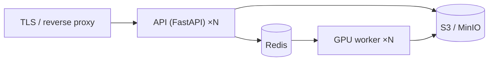

# Deployment

VoiceMorph deploys as a small set of services: a stateless **API**, one or more
**GPU workers**, **Redis** (broker), and **S3/MinIO** (artifacts).

## Topology



- **API** is stateless → scale horizontally behind a load balancer. Terminate
  TLS at the proxy; the API key is a bearer secret.
- **Workers** are GPU-bound → scale on queue depth; pin to GPU nodes. Keep hot
  voice models resident (the engine caches per `voice_id`).
- **Redis** brokers jobs and holds job status (`RedisJobStore`).
- **S3/MinIO** stores trained models and job artifacts, shared by API + workers.

## Docker Compose (single box)

The fastest production-shaped setup — API + GPU worker + Redis + MinIO:

```bash
export VOICEMORPH_API_KEY=<strong-secret>
docker compose -f docker/docker-compose.yml up --build
```

- API on `:8000`, MinIO console on `:9001`.
- The `worker` service requires an NVIDIA GPU + the NVIDIA Container Toolkit.
  On a GPU-less box, comment out `worker` and run the API in `eager` mode for a
  CPU smoke test.
- Mount RVC weights into the worker at `/root/.voicemorph/models` (see
  [ENGINE.md](./ENGINE.md) and set `VOICEMORPH_MODELS`).

Images: [`docker/api.Dockerfile`](../docker/api.Dockerfile) (light, no GPU),
[`docker/inference.Dockerfile`](../docker/inference.Dockerfile) (CUDA + RVC).

## Kubernetes (scale-out)

Recommended shape (manifests/Helm are a planned addition under `infra/`):

- **api** Deployment + Service + Ingress (TLS). HPA on CPU/req rate.
- **worker** Deployment on a GPU node pool (`nvidia.com/gpu` requests, node
  selector/taints). **HPA on Redis queue depth** (KEDA works well).
- **redis** (managed or a StatefulSet), **MinIO** or cloud S3.
- Secrets: `VOICEMORPH_API_KEY`, S3 credentials via Kubernetes Secrets.
- Store model weights on a shared PVC or bake them into the worker image.

## Configuration

All via `VOICEMORPH_*` env vars — see [CONFIGURATION.md](./CONFIGURATION.md).
Production checklist:

- [ ] Strong `VOICEMORPH_API_KEY` (not `change-me`).
- [ ] `VOICEMORPH_ENGINE_BACKEND=rvc`, `VOICEMORPH_JOB_MODE=celery`,
      `VOICEMORPH_STORAGE_BACKEND=s3`.
- [ ] TLS in front of the API; restrict `VOICEMORPH_CORS_ORIGINS`.
- [ ] Upload limits + queue backpressure tuned.
- [ ] Model weights present on workers; GPU visible (`nvidia-smi`).

## Observability

Recommended: structured logs, Prometheus metrics (request latency, job duration,
real-time factor, GPU utilization, queue depth), and tracing. Wiring these into
`infra/` is on the [roadmap](./ROADMAP.md).
